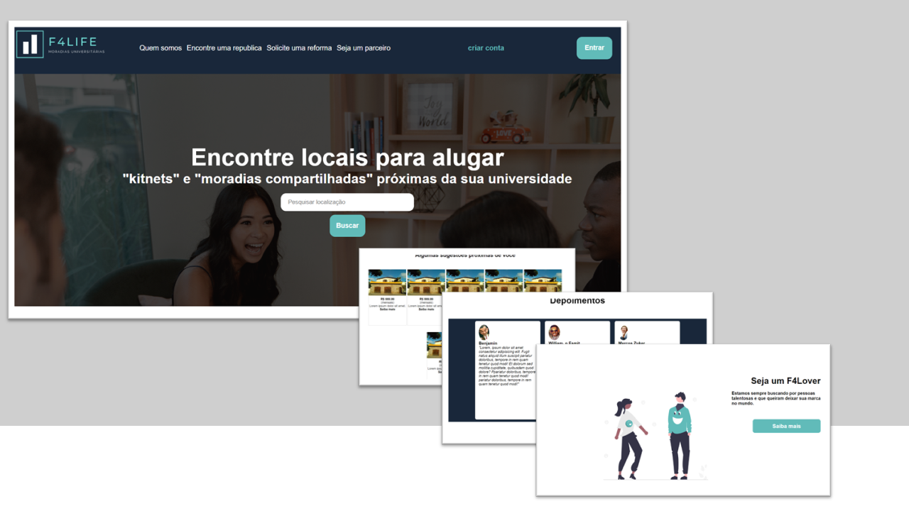

# Tela de Login

## Sobre o projeto
Landing Page elaborada como um projeto solicitado pela a
Projeto de estudo solicitado pela Labenu para criação de uma "Landing Page" de uma empresa ficticia, conforme as solicitações especificadas. 

Solicitação da empresa:
"F4Life é uma empresa de aluguéis de repúblicas para pessoas universitárias. Similar aos modelos de Quinto Andar e Loft, a empresa realiza reformas e prepara moradias para recepção de pessoas universitárias em um ambiente específico e otimizado para a vida de graduação. Você precisa criar uma landing page que chame a atenção de pessoas que estão na graduação e ofereça os produtos "moradia compartilhada" e "kitnets"."

Página responsiva para Desktop, Tablet e Mobile.

## Tecnologias

- HTML
- CSS
- Git e Github

## Contato

emidio.daniel@hotmail.com

